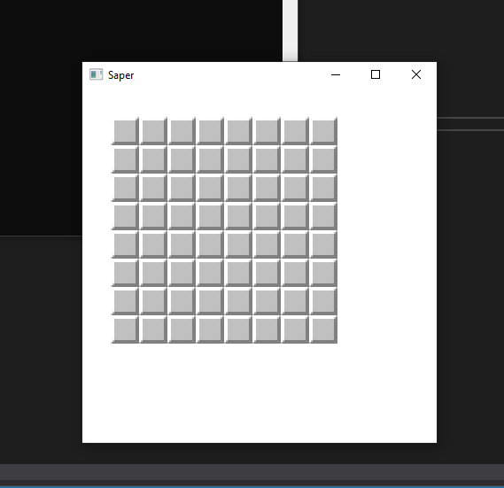
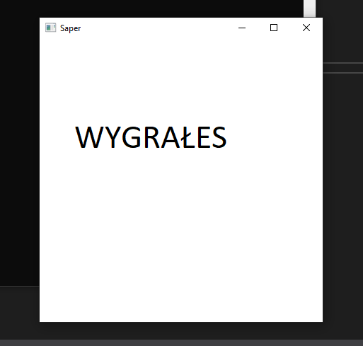
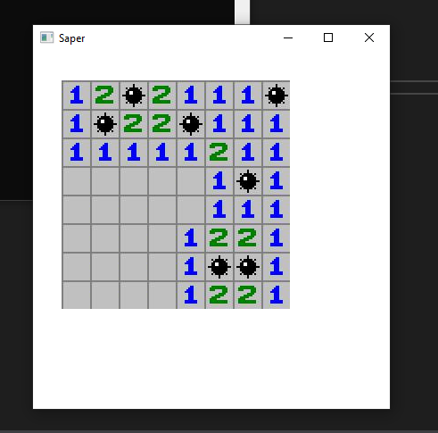
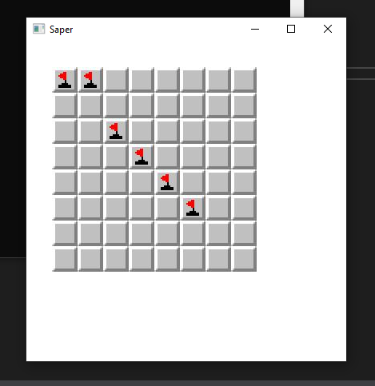

# Project description 
Project made for collage c++ labs as summary project. Project made with SFML 2.5.1.
Project implements basic functionality of minesweeper game.

## Instalation 
If you want to install it on your local computer you need to:
1. Download this project 
2. Install SFML 
3. Add SFML to Project dependecies
4. Run your project

## Available game option
* Display only blank board 
* Change level of game difficulty (Available 1, 2, 3 need to be done in source code)
* Display win plate when user win the game
* Show all bombs that was uncover
* With right click you can set flags on bombs and if all bombs are cover by flag you win

Levels gives you more bombs and bigger board

### Images

#### Blank board 

#### Level 2 

#### Level 3

#### Win plate  

#### Lose plate 

#### Flags

